# Event Management System API

## Project Description

The Event Management System is a web application built with ASP.NET Core, Entity Framework Core, and PostgreSQL. It uses ASP.NET Core Identity for user authentication and authorization, and integrates with Azure services for storage and monitoring.

## Features

1. **User registration and authentication** with ASP.NET Core Identity.
2. **Role-based authorization** (Admin, EventProvider, User).
3. **CRUD operations** for events.
4. **Event registration with FIFO processing** using Azure Service Bus and Azure Functions.
5. **Storage of event metadata and user interactions** in Cosmos DB for NoSQL. (_Optional_)
6. **Storage of images and documents** in Azure Blob Storage.
7. **Caching of event data** with Redis. (_Optional_) - Unfinished
8. **Monitoring and diagnostics** with Azure Application Insights.

## Database Structure

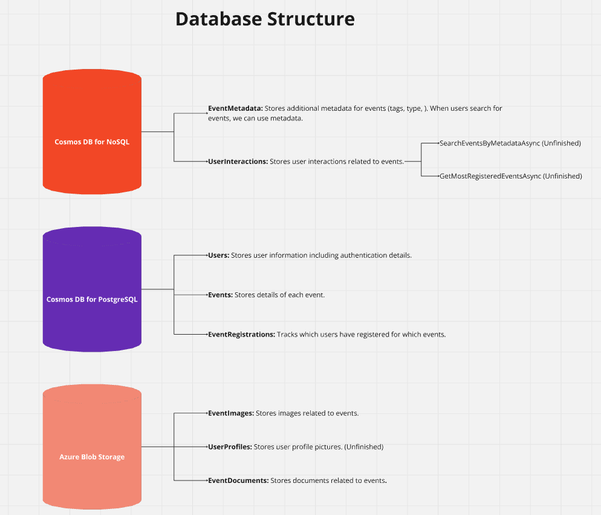

## Workflow

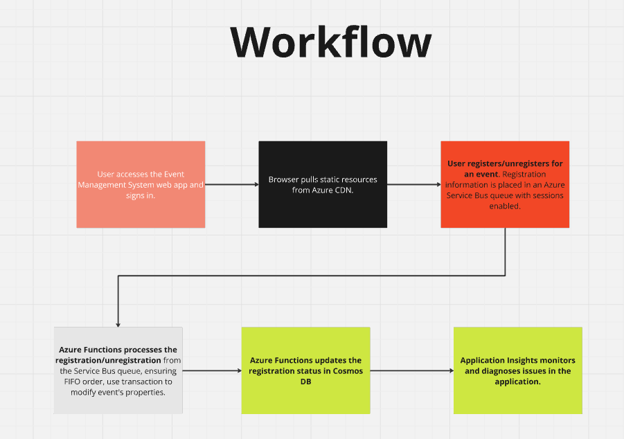

## Aure Resources group

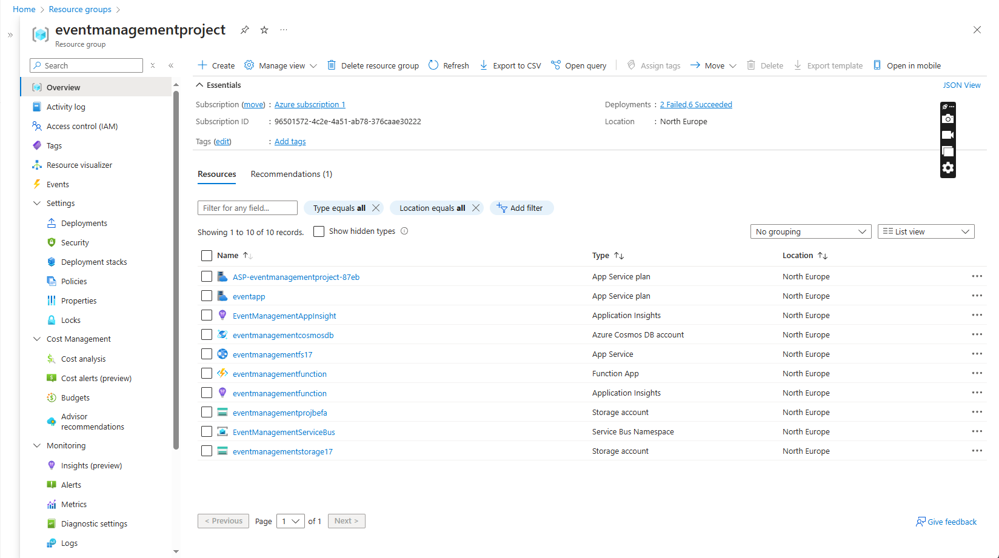

## Azure Application Insights

1. Performance
   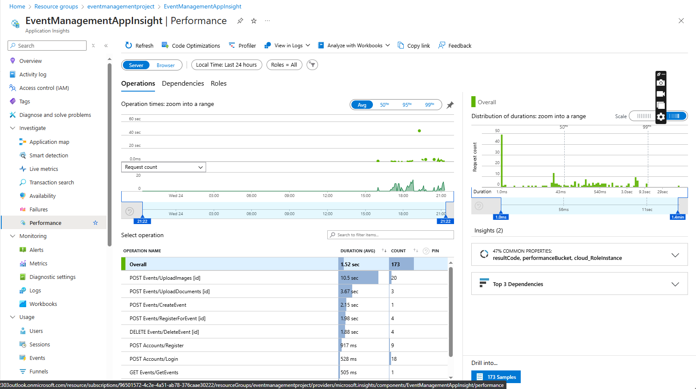
   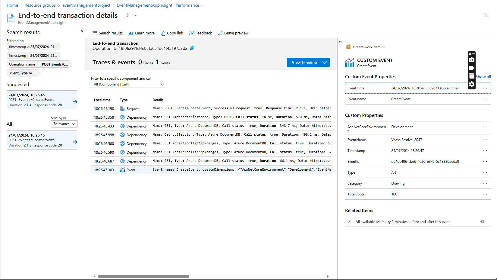
2. Failures
   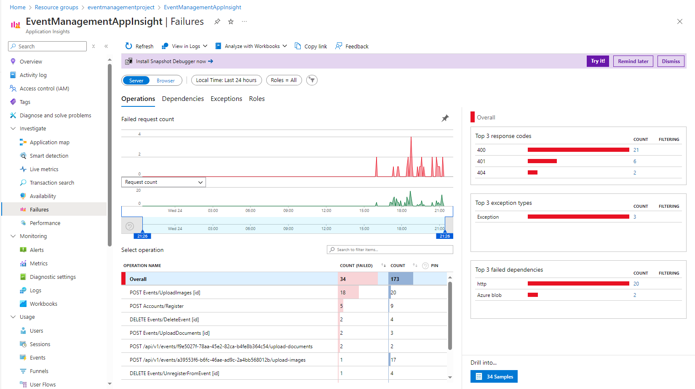

## Azure Service Bus

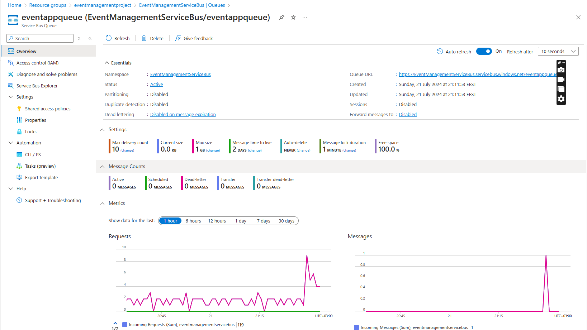

## Azure Function App

- Public repository: [https://github.com/tripplen23/EventManagementFunctions](https://github.com/tripplen23/EventManagementFunctions)
- Registering for event successfully
  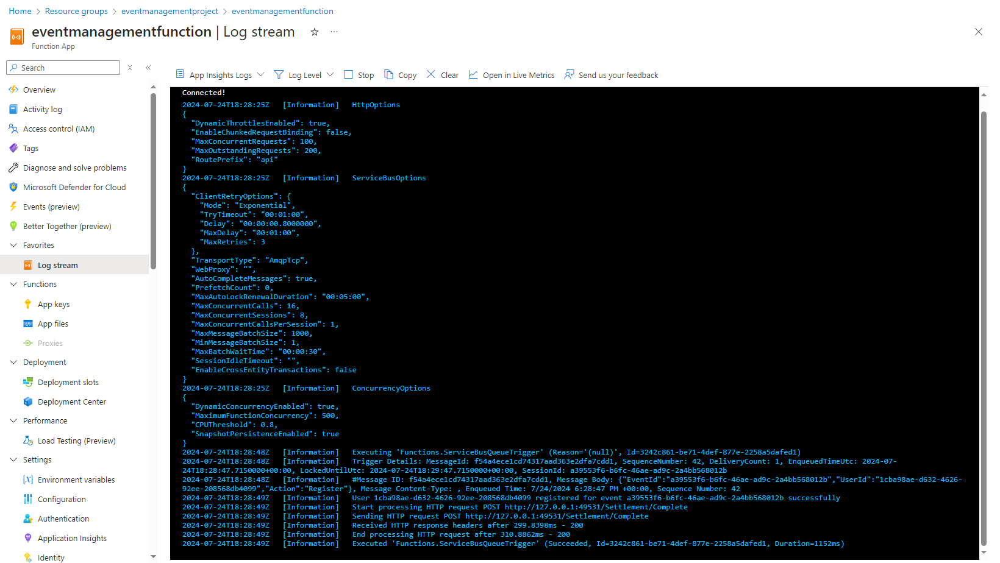

## Azure Cosmos DB for PostgreSQL Cluster

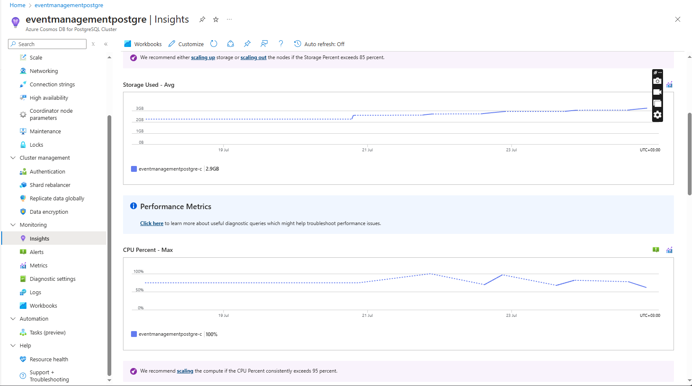

## Azure Cosmos DB for NoSQL

1. Event Metadata
   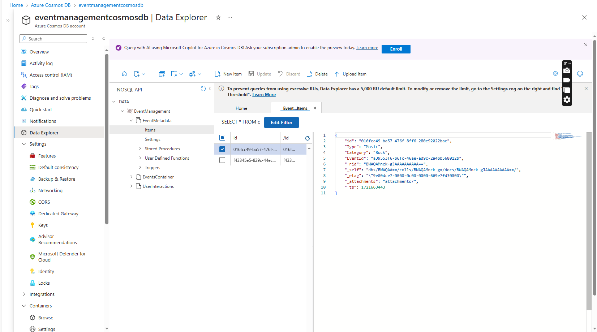
2. User Interactions
   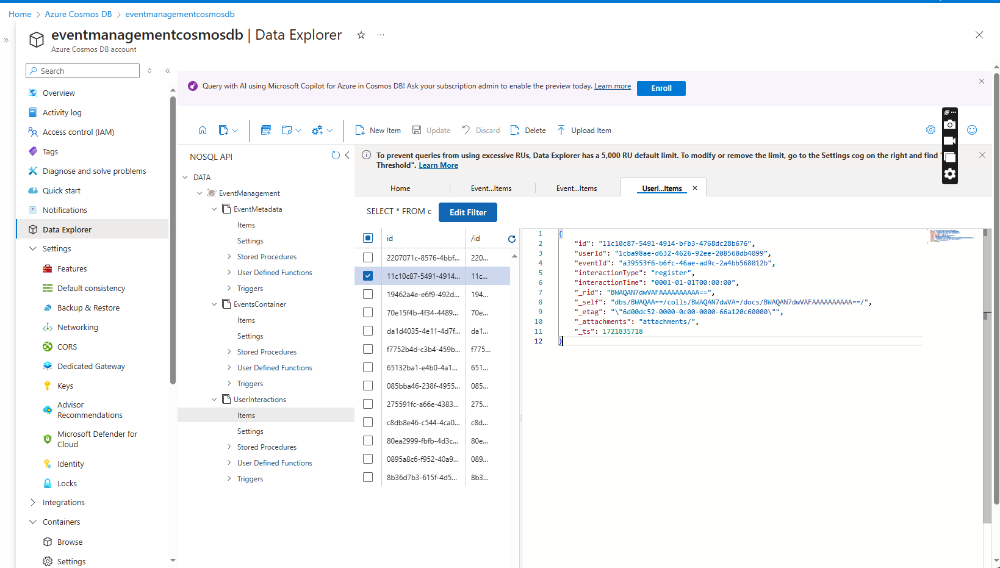

## Video demo

1. Log in with Event Provider account
2. Create a new Event
3. Log in as an User
4. Register for the event
5. Event registration is accepted in the Service Bus Queue
6. Azure Functions will trigger Queue and saved registration information into PostgreSQL database

Please download the demo video via: [https://github.com/tripplen23/az-event-management/blob/main/image/README/demofuntion.mp4]()

## Contact Information

Email: binh.nguyen@integrify.io
